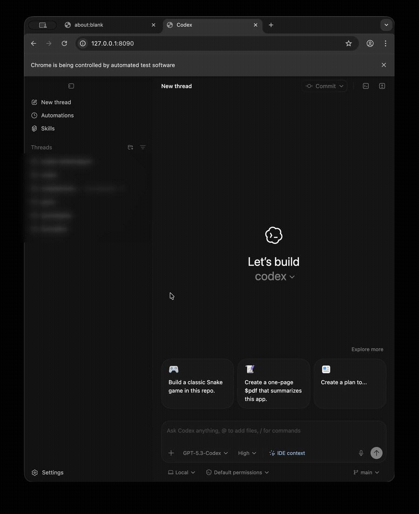

# codex-webstrap



`codex-webstrap` is a macOS wrapper that lets you run the Codex desktop client UI in a browser while keeping backend execution local.

This started as a personal project to remotely access the Codex desktop experience; it is open sourced so others can use and improve it.

## What It Is

Codex desktop is not a pure web app. The renderer expects Electron preload APIs, IPC, local process control, worker threads, and desktop-only integrations.

`codex-webstrap` makes browser access possible by:

1. Serving Codex's bundled web assets.
2. Injecting a browser shim that emulates key `electronBridge` preload methods.
3. Bridging renderer messages over WebSocket to local backend handlers.
4. Forwarding app protocol traffic to local `codex app-server` and UDS IPC where available.

Default endpoint: `http://127.0.0.1:8080`

## Architecture

### Core Components

- `bin/codex-webstrap.sh`
  - CLI entrypoint and env/arg normalization.
- `src/server.mjs`
  - HTTP + WS host, auth gating, startup orchestration.
- `src/auth.mjs`
  - Persistent token bootstrap + `cw_session` cookie sessions.
- `src/assets.mjs`
  - Discovers Codex app bundle, extracts/caches `app.asar` assets, patches `index.html`.
- `src/bridge-shim.js`
  - Browser-side Electron preload compatibility layer (`window.electronBridge`).
- `src/ipc-uds.mjs`
  - Framed UDS client (`length-prefix + JSON`) for `codex-ipc`.
- `src/app-server.mjs`
  - Local `codex app-server` process manager over stdio JSON-RPC.
- `src/message-router.mjs`
  - Message dispatch, terminal lifecycle, worker bridge, unsupported fallbacks.

### Runtime Flow

1. Wrapper starts Node server and loads config.
2. Auth token is created/read from token file.
3. Codex app assets are extracted to a versioned cache directory.
4. Patched `index.html` is served with shim injection.
5. Browser opens `/`, shim connects to `ws://<host>/__webstrapper/bridge`.
6. Renderer messages are routed to:
   - app-server JSON-RPC (`thread/*`, turns, config, etc.)
   - UDS broadcast forwarding where relevant
   - terminal sessions (`spawn`, `write`, `close`)
   - git worker bridge path
7. Results are sent back as bridge envelopes and posted to the renderer via `window.postMessage`.

## Why This Is Not "Native Web"

Codex desktop behavior depends on Electron/main-process features unavailable to normal browser JavaScript, including:

- preload-only bridge APIs
- local privileged process orchestration
- desktop IPC channels
- local worker/protocol assumptions

This project provides near-parity by emulation/bridging, not by removing those dependencies.

## API Surface

### CLI

```bash
./bin/codex-webstrap.sh [--port <n>] [--bind <ip>] [--open] [--token-file <path>] [--codex-app <path>]
```

### Environment Overrides

- `CODEX_WEBSTRAP_PORT`
- `CODEX_WEBSTRAP_BIND`
- `CODEX_WEBSTRAP_TOKEN_FILE`
- `CODEX_WEBSTRAP_CODEX_APP`
- `CODEX_WEBSTRAP_INTERNAL_WS_PORT`

### HTTP Endpoints

- `GET /`
- `GET /__webstrapper/shim.js`
- `GET /__webstrapper/healthz`
- `GET /__webstrapper/auth?token=...`

### WebSocket Endpoint

- `GET /__webstrapper/bridge`

### Bridge Envelope Types

- `view-message`
- `main-message`
- `worker-message`
- `worker-event`
- `bridge-error`
- `bridge-ready`

## Setup

### Prerequisites

- macOS
- Node.js 20+
- Installed Codex app bundle at `/Applications/Codex.app` (or pass `--codex-app`)
- `codex` CLI available in `PATH` (or set `CODEX_CLI_PATH`)

### Install

```bash
npm install
```

### Run

```bash
./bin/codex-webstrap.sh --port 8080 --bind 127.0.0.1
```

Optional auto-open:

```bash
./bin/codex-webstrap.sh --open
```

## Authentication Model

1. On first run, a random token is persisted at `~/.codex-webstrap/token` (default path).
2. You authenticate once via:

```bash
open "http://127.0.0.1:8080/__webstrapper/auth?token=$(cat ~/.codex-webstrap/token)"
```

3. Server sets `cw_session` cookie (`HttpOnly`, `SameSite=Lax`, scoped to `/`).
4. UI and bridge endpoints require a valid session cookie.

## Security Risks and Recommendations

This project can expose powerful local capabilities if misconfigured. Treat it as sensitive software.

### Primary Risks

- Remote users with valid session can operate Codex UI features and local workflows.
- Token bootstrap URL can be leaked via shell history, logs, screenshots, or shared links.
- Binding to non-local interfaces increases attack surface.
- No built-in TLS termination. Plain HTTP should not be exposed directly to the public internet.

### Recommended Safe Usage

- Keep default bind: `127.0.0.1` unless remote access is required.
- If remote access is needed, use a private overlay network (for example Tailscale/WireGuard) and not public port-forwarding.
- Do not share token values in chat, screenshots, logs, issue reports, or commit history.
- Rotate token file if exposure is suspected:

```bash
rm -f ~/.codex-webstrap/token
```

Then restart wrapper to generate a new token.

- Consider external TLS/auth proxy if you must serve beyond localhost.

## Functional Coverage Notes

Implemented coverage includes:

- core message routing (`ready`, `fetch`, `mcp-*`, `terminal-*`, `persisted-atom-*`, `shared-object-*`)
- thread lifecycle actions including archive/unarchive pathing
- worker message support (including git worker bridge)
- browser equivalents for desktop-only UX events (open links, diff/plan summaries)
- graceful unsupported handling for non-web-native desktop actions

Unknown message types produce structured `bridge-error` responses and do not crash the session.

## Development

### Run Tests

```bash
npm test
```

### Worktree Bootstrap

Bootstrap env/secrets from another worktree checkout:

```bash
./scripts/worktree-bootstrap.sh --dry-run
./scripts/worktree-bootstrap.sh --mode symlink
```

Core paths are configured via:

- `scripts/worktree-secrets.manifest`

Codex setup-script compatible command:

```bash
./scripts/worktree-bootstrap.sh --mode symlink --overwrite backup --extras on --install on --checks on
```

### Typical Troubleshooting

- `401 unauthorized`
  - Authenticate first via `/__webstrapper/auth?token=...`.
- UI loads but actions fail
  - Check `GET /__webstrapper/healthz` for app-server/UDS readiness.
- Codex app not found
  - Pass `--codex-app /path/to/Codex.app`.
- `codex` CLI spawn failures
  - Ensure `codex` is on `PATH` or set `CODEX_CLI_PATH`.

## License

MIT. See `LICENSE.md`.
